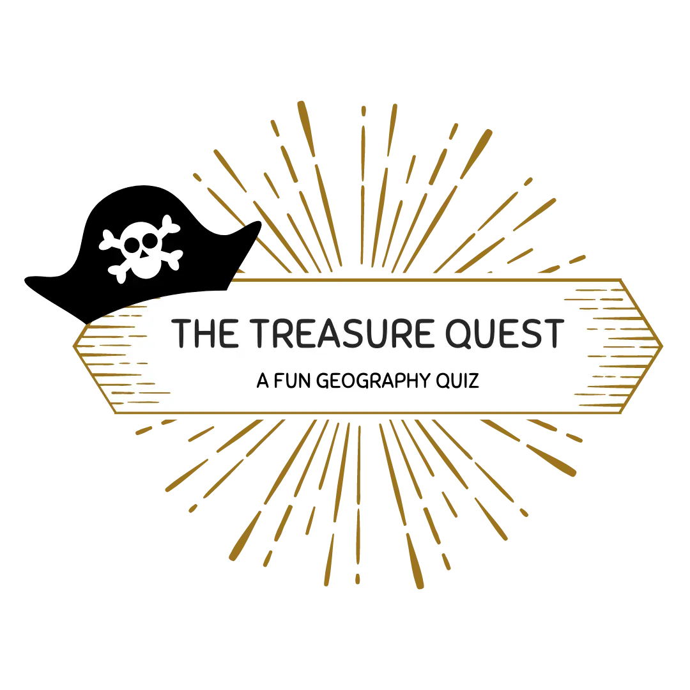
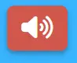

# **_The Treasure Quest - Project Portfolio 2_**

This document offers a comprehensive guide to a dynamic Quiz Game I have developed, designed to challenge users with a series of questions categorised under 'easy' and 'hard' difficulties. Crafted with HTML, CSS, and JavaScript, this interactive game aims to provide an engaging and educational experience for users aged 7-11. Titled ‘The Quest for the Treasure,’ the game entices players to test their knowledge across various subjects relating to the school Geography curriculum, rewarding perfect scorers with the ultimate prize - finding the treasure.

The live site can be viewed here - <a href="https://sophiemcgee.github.io/the-treasure-quest/" target="_blank" rel="noopener">The Treasure Quest</a>

# Contents

* [**Website Objectives**](<#website-objectives>)
* [**User Experience UX**](<#user-experience-ux>)
    * [**Client Background and Goals**](<#client-background-and-goals>)
    * [**Target Audience**](<#target-audience>)
    * [**User Stories**](<#user-stories>)
    * [**Market Research**](<#market-research>)
        * [Industry Analysis](<#industry-analysis>)
        * [Educational Trends and Gamification](<#educational-trends-and-gamification>)
        * [User Engagement Strategies](<#user-engagement-strategies>)
        * [Content Relevance and Diversity](<#content-relevance-and-diversity>)
        * [Safety and Accessibility](<#safety-and-accessibility>)
        * [Community and Social Interaction](<#community-and-social-interaction>)
* [**Design**](<#design>)
    * [**Planning and Development**](<#planning-and-development>)
        * [Strategy](<#strategy>)
        * [Scope](<#scope>)
        * [Structure](<#structure>)
        * [Skeleton](<#skeleton>)
        * [Surface](<#surface>)
    * [**Colour Scheme and Typography**](<#colour-scheme-and-typography>)
        * [Typography](<#typography>)
        * [Colour Scheme](<#colour-scheme>)
    * [**Website Logo**](<#website-logo>)
* [**Features**](<#features>)
    * [**Generic Game Features**](<#generic-game-features>)
        * [Responsive Design](<#responsive-design>)
	    * [Visual Feedback and Interactivity](<#visual-feedback-and-interactivity>)
	    * [Accessibility Considerations](<#accessibility-considerations>)
        * [Clear Navigation](<#clear-navigation>)
        * [Hero Section](<#hero-section>)
        * [Call-to-Action Buttons](<#call-to-action-buttons>)
        * [Favicon](<#favicon>)
        * [Footer](<#Footer>)
        * [Testimonials](<#testimonials>)
        * [404 Page](<#404-page>)
        * [Contact Page](<#contact-page>)
    * [**Homepage Features**](<#homepage-features>)
        * [About Section](<#about-section>)
        * [Services Section](<#services-section>)
        * [Pricing Section](<#pricing-section>)
    * [**About Page Features**](<#about-page-features>)
        * [Main About Section](<#main-about-section>)
        * [Reasons to Work With Me Section](<#reasons-to-work-with-me-section>)
    * [**Service Page Features**](<#service-page-features>)
        * [Introduction Section](<#introduction-section>)
        * [Main Services Section](<#main-services-section>)
        * [Process Section](<#process-section>)
     * [**Future Features**](<#future-features>)
        * [Portfolio Page](<#portfolio-page>)
        * [Content Request Form](<#content-request-form>)
        * [Client Dashboard and Integration](<#client-dashboard-and-integration>)
        * [Blog Page](<#blog-page>)
* [**Technologies Used**](<#technologies-used>)
* [**Deployment**](<#deployment>)
    * [**Opening the repository**](<#opening-the-repository>)
    * [**Forking the repository**](<#forking-the-repository>)
    * [**Cloning the repository**](<#cloning-the-repository>)
* [**Testing**](<#testing>)
    * [**Validator Testing**](<#validator-testing>)
        * [HTML Validation](<#html-validation>)
        * [CSS Validation](<#css-validation>)
    * [**Responsivity Testing**](<#responsivity-testing>)
    * [**Accessibility Testing**](<#accessibility-testing>)
    * [**Performance Testing**](<#performance-testing>)
    * [**Testing of User Stories**](<#testing-of-user-stories>)
    * [**Manual Testing of Features**](<#manual-testing-of-features>)
    * [**Bugs**](<#bugs>)
* [**Credits**](<#credits>)
* [**Acknowledgements**](<#acknowledgements>)

# Game Objectives

The core objective of 'The Treasure Quest' quiz game is to engage users in a challenging yet entertaining knowledge test, with questions that span a variety of topics which children aged 7-11 will be familiar with. The aims of the project are:

* Educational Engagement: Provide a platform for players to test and expand their knowledge across different difficulty levels. Whether users are looking for a light-hearted quiz experience with 'easy' questions or a more challenging quiz with the 'hard' mode, the game offers something for everyone.
* User Experience Focus: Emphasise the importance of a seamless and engaging user experience, showcasing intuitive UI/UX that keeps players returning for more. For example, the final challenge of achieving a perfect score to 'find the treasure' adds an extra layer of excitement, making each playthrough a unique adventure.
* Encourage Learning through Play: Foster an environment where learning is encouraged through the fun and interactive nature of a quiz game, reinforcing knowledge and perhaps inspiring users to delve deeper into topics of interest.

[Back to top](<#contents>)

# User Experience (UX)

## Client Background and Goals

As the creator behind 'The Treasure Quest' quiz game, the project is personal to me, and is crafted with the intent of offering an engaging and educational experience for my children and their friends. The idea for developing 'The Treasure Quest' was inspired by observing my children's curiosity and their natural inclination towards interactive digital content. Recognising the potential of interactive learning to enhance education outside the classroom, I aimed to combine elements of play with educational content, hopefully making learning an enjoyable experience. The following are my key personal goals for the project:

* Foster a Love for Learning: The game is designed to spark curiosity and encourage exploration amoung children aged between 7 and 11. Through a variety of questions ranging from easy to hard difficulty levels, it aims to challenge them in a fun way, promoting critical thinking and retention.
* Provide a Safe and Engaging Platform for Children: In a digital age where content quality can be variable, ensuring this game serves as a safe, positive, and enriching online space for children is paramount. The content is carefully curated to be age-appropriate and informative.
* Encourage Social Interaction: By including features that allow for sharing scores and achievements on social media pages created for the quiz game, the quiz encourages healthy competition and interaction amoung peers, fostering social bonds through shared challenges and learning experiences.
* Accessibility and Inclusivity: Ensuring the game is accessible to children of various ages and learning stages is key. The game's design considers diverse needs, making it inclusive and enjoyable for a broad audience of young learners.
* Track Progress and Celebrate Achievements: Incorporating mechanisms for tracking progress and providing immediate feedback aims to motivate children to improve and challenge themselves. Achieving a perfect score and 'finding the treasure' is positioned as a significant accomplishment, encouraging repeated play and continuous learning.

[Back to top](<#contents>)

## Target Audience
 
In conceptualising 'The Treasure Quest' quiz game, understanding and defining the target audience was pivotal to tailor the game's design, content, and functionality to meet the needs and interests of its intended players. Through observations, interactions, and my personal experiences with my children and their friendship circle, the primary user groups for this game have been identified as follows:

* Children Aged 7 to 11: The core audience, with the game's content, difficulty levels, and interface specifically designed to be engaging, challenging, yet accessible for this age group.
* Parents and Guardians: Individuals seeking quality educational content that not only entertains but also provides meaningful learning experiences for their children.
* Educators and Teachers: Professionals looking for interactive tools to supplement traditional teaching methods, engage students, and encourage learning outside the classroom.

[Back to top](<#contents>)

## User Stories

Based on the target audience I have defined five possible user stories:

<b> 1. Children Aged 7 to 11</b>

* As a child, I want the quiz game to be fun and colourful so that I can enjoy learning and playing at the same time.
* I expect the game to have questions that are challenging but fair for my age, helping me learn new things without feeling overwhelmed.
* The game should cover different topics, providing a variety of questions that cater to my interests within the Geography school subject.

<b>2. Parents and Guardians</b>

* As a parent, I want to ensure that the content of the game is safe and educational, providing my child with a positive and enriching experience.
* I expect the game to offer feedback and more information when a question is answered incorrectly to provide more help and encouragement.
* The game should offer settings or controls that allow me to adjust the difficulty level, tailoring the experience to my child’s learning needs and preferences.

<b>3. Educators and Teachers</b>

* As an educator, I want to incorporate the quiz game as a supplementary learning tool that complements the curriculum and engages students in a fun way.
* I expect the game to cover a range of topics that align with educational standards and objectives, reinforcing what students are learning in class.
* The game should provide clear progress and results at the end, enabling me to identify topics where the class as a whole might need further instruction or review.

[Back to top](<#contents>)

## Market Research

In the initial phase of developing 'The Treasure Quest', an extensive market research initiative was undertaken to comprehend the educational gaming landscape and to ensure the game resonates with the preferences and learning objectives of our primary audience: children and their supporting communities, including parents, educators, and homeschooling networks. This research into the educational and entertainment gaming sector provided critical insights into current trends, user engagement strategies, and the educational value of interactive content. Grasping the unique attributes of educational gaming helped inform the development process, particularly in designing a game that is both informative and enjoyable.

### Industry Analysis

A thorough analysis of the competitive landscape within educational gaming was conducted to understand the positioning, content strategy, and user engagement practices of existing games in the market. This research ranged from comprehensive educational platforms to simple quiz-based games and included a detailed look at game mechanics, educational outcomes, thematic content, and the integration of motivational elements designed to enhance learning through play. The quiz games analysed were:
* [National Geographic Kids](https://www.natgeokids.com/au/category/other/quiz/)
* [Beano](https://www.beano.com/categories/geography-quizzes)
* [Quiz Global](https://quizglobal.com/quizplay/quizplayqanda/Easy%20Kids%20-%20Geography%20Questions%20and%20Answers)
* [Twinkl](https://www.twinkl.ie/search?q=geography+quiz&c=103&r=parent&fco=17459)

### Educational Trends and Gamification:

Understanding how educational trends are evolving, particularly the integration of gamification in learning, helped shape the game's objectives and structure. The focus was on creating an engaging learning experience that encourages knowledge acquisition through interactive gameplay.

#### Design Implications

* Design for Engagement: Incorporate game mechanics such as points/scores that players can earn as they progress through the quiz. This turns learning into a more rewarding experience.
* Learning Objectives Integration: Align game challenges with specific learning objectives, ensuring that gameplay directly contributes to educational goals.

### User Engagement Strategies

Research into successful user engagement strategies within educational games provided direction on how to maintain player interest and motivation. This included mechanisms for progress tracking, rewards, and adaptive difficulty levels to cater to a broad range of abilities and interests.

#### Design Implications

* Progress Tracking and Feedback: Implement a visible progress bar or achievement milestones. Immediate feedback on answers can help reinforce learning.
* Adaptive Difficulty: Design the game to adjust difficulty based on the player's performance, ensuring it remains challenging yet achievable to maintain interest.

### Content Relevance and Diversity

Ensuring the game's content is relevant, diverse, and inclusive was a priority identified through market research. This meant selecting quiz topics and questions that reflect a wide range of subjects, catering to the varied interests and educational needs of children.

#### Design Implications

* Offer a wide array of topics and difficulty levels to cater to diverse interests and educational needs. This could involve collaborations with educators to ensure accuracy and relevance.
* Ensure representation in game content, characters, and narratives that reflect a diverse player base, promoting inclusivity and cultural awareness.

### Safety and Accessibility

Key considerations were given to making the game safe and accessible for children. This included designing an interface that is user-friendly for children at different stages of development and learning.

#### Design Implications

* Child-Friendly Interface: Use simple, intuitive interfaces with larger buttons and readable fonts. Consider voice-over options for younger children who may have limited reading skills.
* Cross-Platform Accessibility: Design the game to be accessible across various devices, including tablets, smartphones, and computers, ensuring a seamless experience regardless of how players access it.

### Community and Social Interaction

Insights into the importance of community and social interaction within educational platforms led to plans for the inclusion of features that allow for sharing achievements and fostering a sense of community amoung players, such as score sharing.

#### Design Implications

* Social Features: Allow players to share scores or achievements on social media to foster competition and camaraderie.

[Back to top](<#contents>)

# Design

## Planning and Development

The design process of "The Treasure Quest" quiz game was meticulously planned to ensure an engaging, educational, and user-friendly experience. Drawing from the principles of game design and user experience (UX), the project was developed through the five planes of UX—Strategy, Scope, Structure, Skeleton, and Surface, resulting in a game that is both visually captivating and intuitive to play across various platforms.

### Strategy

In the initial strategy phase, the goal was defined of creating a game that could captivate children while serving educational purposes. This involved defining a compelling narrative that guides the gameplay, making learning an adventure. The game was envisioned to challenge players across a spectrum of difficulty levels while ensuring content relevance and safety. Central to this phase was understanding the target audience—children and their extended community—and aligning the game's objectives with their educational and entertainment needs.

### Scope

With the strategy outlined, the scope was determined to identify the essential features and functionalities of the game. This included:

* A dynamic question engine capable of serving randomised questions based on selected difficulty.
* Progress tracking mechanisms to encourage continued engagement.
* A reward system of finding the treasure when a perfect score is achieved to motivate learning.
* User interfaces designed for children, considering their interaction patterns and accessibility needs.

### Structure

The structure of the game focused on creating an intuitive flow that guides players from the difficulty selection through the quiz to the final feedback on their performance. Effort was made to organise content in a way that's easily navigable, ensuring a smooth progression for players of varying ages and abilities. The game architecture was designed to be flexible, allowing for future content updates and expansions.

### Skeleton

During the skeleton phase, wireframing and prototyping were conducted to visualise the game’s layout and interactions. This step was crucial in laying out the placement of interactive elements such as question displays, answer options, next question triggers, and feedback notifications. A focus was placed on creating a balance between visual appeal and functionality, ensuring that game elements are accessible and engaging for the target demographic. Prototypes were tested and refined to optimise user experience across devices, emphasising responsiveness and ease of use.

<b>This wireframe is available to view within Figma via <a href="https://www.figma.com/file/emfhPcFWQ6JCpErbkXPCqR/The-Treasure-Quest?type=whiteboard&node-id=0%3A1&t=xKgywFtGAzySzKDC-1" target="_blank" rel="noopener">THIS LINK.</a></b>

### Surface

During the surface design I brought the game to life with vibrant colors, engaging graphics, and buttons that appeal to children. Careful consideration was given to font choices, colour schemes, and imagery to ensure readability and draw interest while maintaining a fun and safe environment for learning. The final design encapsulates a treasure-hunt theme, with each quiz attempt designed to be a new adventure.

[Back to top](<#contents>)

## Colour Scheme and Typography

### Typography

For the typography of "The Treasure Quest," particular attention was dedicated to creating an inviting and engaging visual identity that resonates with a young audience. The primary typeface chosen is 'Sniglet', known for its fun and friendly aesthetic. This font, with its rounded and soft edges, enhances the playful nature of the game and makes on-screen reading enjoyable and easy for children. 'Sniglet' was sourced from Google Fonts to ensure high-quality rendering across different platforms and browsers.

To ensure robustness and maintain a seamless user experience, a generic sans-serif fallback is used. This fallback approach guarantees that in the absence of 'Sniglet', the text still retains an approachable and clean appearance, crucial for maintaining usability and style consistency throughout the game.

For in-game questions and instructions, 'Sniglet' is set with a bold weight to capture attention and differentiate actionable items from informational text. Headings and important calls to action utilise a larger font size to stand out effectively, while regular body text is slightly smaller to create a clear visual hierarchy, enhancing both engagement and readability.

Strategic use of varying font weights and sizes is also evident in interactive elements such as buttons and scoreboards. This tailored approach in media queries ensures that on larger screens, the text remains proportionally balanced and visually compelling. Such thoughtful typographic treatment supports the overall game design, fostering an interactive and child-friendly interface that encourages continuous learning and exploration.

### Colour Scheme

At the start of the project I sourced an image to use as the game background from Canva, as shown below. This fun, exciting background provided the ideal layout for my quiz game containers, with space for a header and footer. 

The colour scheme within the background image was perfectly in line with the plan I had created following my research and the colours used helped to form the basis of the overall colour scheme. The image below shows the colour scheme broken into main game colours, and the secondary colours used for game actions.

The chosen colour scheme combines vibrant primary colors with softer secondary hues to create an immersive and engaging experience for young players. Each colour is carefully selected to reinforce the pirate/treasure theme while optimising readability and usability throughout the game interface.

Main Colours:

1. #FFC966 (Gold):
The choice of gold as one of the main colours in the game's palette evokes a sense of treasure and adventure, aligning perfectly with the pirate theme, it is also used within the background image. The page background is set to this colour by default, so if the image does not load, it does not disrupt the design of the game. 

2. #7ED957 (Lime Green):
Lime green injects a burst of energy and vitality into the colour scheme. This bright and cheerful colour represents the green tones of tropical islands and the thrill of exploration. It's prominently featured in the timer circle when time left is above 5 seconds, and the button to go to the next question, reinforcing a sense of accomplishment and encouraging engagement.

3. #E96854 (Coral Red):
Coral red introduces a bold and dynamic element to the palette, symbolising adventure and danger. This vivid shade is strategically applied to elements such as buttons, heightening the challenge within the game.

4. #38B6FF (Sky Blue):
Sky blue used within the background image complements the main colours by providing a refreshing and calming contrast. This serene colours creates a visually pleasing atmosphere reminiscent of clear skies and calm seas.

5. #FAEBD4 (Beige):
Beige serves as a neutral backdrop, enhancing readability and maintaining visual balance. This soft and inviting tone is applied to secondary background elements, question cards, and instruction panels, ensuring that content remains clear and accessible to young players.

Secondary Colours:

Secondary colors in the game are used to highlight specific UI elements like timers, popups, and secondary buttons, providing cues and feedback based on player interactions.

1. Dark Charcoal (#060606): 
This colour is used for primary text and headings. It offers excellent readability against lighter backgrounds and conveys a strong presence and clarity.

2. Soft Red (#ffcccc): 
Applied to timeout popups, this soft red variant draws attention without alarming the player, gently indicating areas that need attention.

3. Darker Red (#d0574b): 
This shade is used for hover states on buttons and critical interactive elements, emphasising areas of interaction and increasing user engagement.

4. Alert Red (#b21124):
Employed in critical warnings within the timer function and as part of the game's feedback timeout mechanism, this red intensifies the urgency or importance, effectively guiding player behavior during time-sensitive tasks.

5. Muted Grey (#aaaaaa): 
This grey is used within the progress circle area to ensure they do not become the focal point, helping maintain focus on more critical elements.

The thoughtful application of these colors enhances the game's visual hierarchy and user experience, making the game not only educational but also visually appealing and engaging for its young audience. The combination of vibrant and soothing colors helps maintain a balance that keeps players motivated and focused, encouraging repeated engagement and deeper learning.

[Back to top](<#contents>)

## Website Logo

Once the game background and colour scheme were finalised I created a logo for the website, which is designed to embody the spirit of adventure and discovery. 

Carefully crafted to resonate with the young audience, the logo itself is based on a traditional treasure map design, with radiating lines that symbolise the excitement of an unfolding adventure. Enhancing the design is a playful skull and crossbones, a nod to the classic pirate theme that's universally associated with treasure quests. The title "THE TREASURE QUEST" is rendered in bold, capitalised letters to convey a sense of significance and reliability. The subtitle "A FUN GEOGRAPHY QUIZ" is presented in a smaller font to provide clear context for the game, ensuring that the educational purpose is understood at first glance. Its distinctive look is designed to capture attention, stimulate curiosity, and, most importantly, reflect the fun learning experience that "The Treasure Quest" delivers.

[Back to top](<#contents>)

# Features

## Generic Game Features

The game is designed with a variety of key features, which can be seen within the images below taken from the various display points: 

### Responsive Design

"The Treasure Quest" game is designed to ensure an optimal and consistent user experience across all devices. With a mobile first design strategy, the design also focuses on adaptability, ensuring that the game remains engaging, accessible, and user-friendly whether it's being played on a desktop computer, tablet, or smartphone. In key areas the game utilises a flexible grid layout that adapts to the width of the browser, ensuring that game elements are displayed optimally on every screen size. This is achieved using code within the css file such as percentages for widths instead of fixed units, allowing the game to fluidly adjust to different screen sizes without compromising on design or functionality. In addition, the game's typography uses responsive font sizes in many areas by adjusting the viewport width (vw) unit, which scales the text based on the width of the screen. This ensures that headings (h1, h2) and other textual content remain legible and proportionate across all devices.

The design implements media queries that target three main breakpoints:

1. Very Small Mobile Screens (Max-width: 360px): Optimisations include adjusting button sizes and font sizes to ensure usability on devices with smaller screens.

2. Small to Medium Devices (Max-width: 600px): Enhancements such as increasing padding and scaling down button text ensure the game remains playable and text remains readable.

3. Tablets and Larger Devices (Min-width: 768px and Min-width: 996px): Provide additional breathing space to the content, increases the size of interactive elements like the progress bar and the timer, and enhances the overall spacing and layout for a more comfortable interaction.

4. Desktops and Large Screens (Min-width: 2400px): For very large screens, the font sizes of headings are scaled using vw to ensure they are imposing and effective, while the main content padding and interactive elements are proportionately scaled to maintain an immersive experience.

### Visual Feedback and Interactivity

"The Treasure Quest" game is designed to deliver an immersive gaming experience through its rich visual feedback mechanisms and distinctive identity, which are fundamental in guiding players through their adventure. Below are the features that enhance the game's visual feedback and identity:

1. Progress Indicators
Visual cues are integral to the game, particularly in the form of progress indicators. The progress grid, with individual circles, provides immediate feedback on the player’s current standing in the quiz. Correct answers are celebrated with a shiny gold coin icon, while incorrect ones are marked with a pirate flag, turning the act of answering questions into a visually engaging narrative.

2. Animated Timer
The countdown timer is another key visual element, bringing a sense of urgency and excitement to the gameplay. The timer changes colour to a more vivid colour and includes a blinking animation to signal the critical last few seconds, effectively guiding the player through the time-sensitive nature of the quiz.

3. Interactive Buttons and Hover Effects
The game's buttons are designed to be not only visually pleasing but also interactive, with hover effects providing clear feedback to the user. This not only adds depth to the game's visual appeal but also enhances usability, clearly signifying to players when an option or control can be interacted with. In addition, buttons are not static but respond to user interactions. For example, hovering over an answer choice triggers a subtle shift in colour or size, providing a tactile sense of engagement that mimics the interactivity of physical game boards.

4. Responsive Feedback Modals
Upon answering questions, responsive modals appear to provide immediate feedback. These are populated based on the correctness of the player’s answer, allowing for an intuitive understanding of the game's response to their actions.

5. Dynamic End-of-Game Display
At the conclusion of each quiz, players are met with a dynamic end-of-game display that changes based on their performance. A perfect score unlocks an animated treasure chest, providing a rewarding visual payoff for the player’s efforts.

6. Interactive Sound Toggle
The sound toggle is a prominent feature within the header area and when sound is off, the toggle displays a muted speaker icon; when turned on, it changes to a speaker with sound waves, providing clear visual feedback regarding the game's current sound status. The sound toggle button animates upon interaction, with a smooth transition between states adding to the visual affirmation of the player's action. 

### Custom Graphics and Illustrations

The game features custom graphics and illustrations that not only add character and charm but also serve as visual metaphors for the user’s journey. These unique design elements reinforce the game’s identity and create a memorable playing experience. Every graphic and illustration in "The Treasure Quest" is designed to transport players into the world of exploration and discovery. From the logo to the playful skull and crossbones, each element has been created to support the narrative of adventure. The game's visual identity is defined by a vibrant colour palette, reinforcing the excitement and fun of the treasure hunt. The colour scheme is not only aesthetically pleasing but also serves a functional purpose.

### Accessibility Considerations

During the development features were implemented to ensure the game is accessible, providing an inclusive experience for all users. This commitment to accessibility is included throughout the code, examples include the following implementations: 

1. The code utilises semantic HTML5 elements which inherently support screen readers and other assistive technologies. This semantic structuring enhances the understanding of the game's content and context for users with visual impairments.

2. ARIA (Accessible Rich Internet Applications) labels and roles are extensively used within our code to provide screen reader users with a clear understanding of each element's purpose. For example, buttons for selecting quiz difficulty levels have aria-label attributes that describe their function, aiding users who cannot visually distinguish these controls.

3. All images within the game, including decorative icons and educational graphics, are equipped with descriptive alt attributes. These descriptions facilitate an understanding of the images' context and purpose for users who cannot see them.

4. When players enter their usernames to save their scores, the code implements error handling that provides clear and immediate feedback. If a username is not entered, an error message is displayed, and the input field is highlighted. This immediate feedback is essential for users who might not be able to perceive the absence of a username without visual cues.

5. For external links, such as those leading to social media pages or additional resources, the code includes mechanisms that inform users they are navigating away from the game. This feature is particularly useful for those using screen readers, as it sets expectations for the resulting action correctly.

6. While the game is colourful and visually vibrant, the design is mindful to ensure that text and interactive elements have sufficient contrast against their backgrounds. This consideration facilitates readability for users with colour vision deficiencies.

7. Players have the option to enable sound effects at any point during the game via a clearly marked sound toggle button. This button is accessible, designed to be easily activated using keyboard navigation or assistive technology, ensuring that all players can engage with the game's audio features if they choose.

### Difficulty Selection

The game begins with an inviting section that sets the stage for the adventure. It features a prominent headline, following by instructions and prompts to choose the difficulty, all aimed at immersing players right from the start. The easy/hard call to action buttons are pivotal in engaging the user from the outset. The difficulty selection buttons not only guide users to the game but also serve as their first interactive experience with the game's interface.

### Clear Navigation
"The Treasure Quest" is coded with the aim of providing a seamless navigational experience for all players. The clarity of the game's navigation is a critical aspect of its design, ensuring that players can intuitively move through the game without confusion. This begins with the game’s HTML structure which is organised in a logical flow that reflects the typical progression of player interaction—from the welcoming screen through the game selection to the quiz questions and final results. This intuitive structure ensures that players naturally understand how to proceed at each stage.

The game also includes buttons and interactive elements to enhance navigation which are consistently styled and behave predictably throughout the game. This consistency allows players to quickly learn and become comfortable with the game mechanics, facilitating ease of use and minimising the learning curve. For example, the 'Restart Quiz' button, is clearly labeled and positioned to allow players to easily start over without having to reselect the difficulty. This button is included within every question and at the end of the game. For players who prefer to visit the homepage to select a new difficulty level, the logo includes a link to this view alongside a button within the end of quiz view which clearly guides users to the homepage.

In addition, a modal serves as a direct form of user feedback, popping up to confirm answer results, and a popup is also included to alert the user when the timer reaches zero. The popup is designed to disappear automatically, with the modal including a clear button to 'Go to Next Question' as a point of exit.

### Dynamic Favicon

A custom favicon reflects the game's identity even in the browser tab, enhancing brand recognition and adding to the overall professional feel of the game.

### Immersive Audio Effects

With sound effects linked to actions such as correct or incorrect answers, players receive auditory feedback that enhances the interactive experience. These sounds are carefully selected to be pleasant and encouraging, contributing to the game's immersive atmosphere. If a player scores a perfect 10 out of 10 score a rewarding fanfare sound plays for 5 seconds in addition to the treasure video. These sounds are all inactive as standard, but can be toggled at any point within the header area.

### Inclusive Footer
The footer not only grounds the design but provides additional navigation options, including social media integration. This offers players the chance to join the game's broader community, share their experiences, or follow updates.

### User Score Submission and High Scores Leaderboard

A key feature is the user's ability to save their score at the end of the game by entering a username and clicking the button below. This form is designed with accessibility in mind, providing both visual and programmatic feedback for users. In addition, the leaderboard is a feature that adds to healthy competitiveness. Users can view high scores stored locally, encouraging replayability and engagement, these also also ordered by user to improve clarity.

### Error Messages

The code handles user input validation, ensuring that any errors are communicated effectively, maintaining an uninterrupted and smooth user experience. For example, when a player attempts to save a score without entering a username, a message will appear, gently prompting for the required information.

### Adaptive Question Pool

The game elevates player engagement by presenting a vast repository of 100 questions tailored to different difficulty levels, with the easy mode providing a more approachable challenge, and the hard mode requiring a deeper knowledge base. This ensures that both novice adventurers and seasoned explorers can find a level that suits their skills.

### Dynamic Question Shuffle
Each game session is designed to be a new experience. The code shuffles the questions using a randomisation function to prevent predictability and encourage replayability. This shuffling mechanic enhances the game's educational value by presenting new challenges every time. Players work their way through 10 questions per session, a number carefully chosen to ensure a balance between a satisfying length and maintaining the player's attention.

[Back to top](<#contents>)

# Technologies Used

* HTML
    * Provided the structural foundation of the game's interface, facilitating content layout and interactive elements.
* CSS
    * Used to style the game, including backgrounds, buttons, and modals, enhancing the visual appeal and ensuring a consistent user experience.
* Javascript
    * Core to the game's functionality, handling events, game logic, sound effects, and dynamic content updates to create an interactive user experience.
* Gitpod
    * The integrated development environment (IDE) used for writing, testing, and debugging the game's code.
* Github
    * Hosted the project repository, enabling version control and release management, ensuring that progress on the game was systematically tracked and stored.
* Canva
    * Utilised for designing the game’s assets such as the logo and various graphical elements integrated within the game to enhance its aesthetic appeal.
* Favicon.io
    * Created the favicon for the game, which appears in the browser tab, aiding in brand consistency and recognition.
* Figma
    * Used for creating detailed wireframes to guide the development of the user interface, ensuring a well-planned layout and user flow.
* Tinypng
    * Optimised the size of the images used in the game to reduce load times and enhance performance, particularly important for users on slower internet connections.
* Font Awesome
    * Icons sourced from Font Awesome were incorporated into the game's design within the social media area and the sound toggle, providing intuitive graphical cues for user interactions.
* Google Fonts
    * Integrated into the game to enhance typography, with fonts selected for readability and thematic alignment with the game’s aesthetic.
* Freesound
    * Sourced sound effects that are triggered during various game actions, such as correct or incorrect answers, enhancing the auditory feedback of the game.
* Twinkl
    * A website used to source and curate the educational content for the quiz questions, ensuring a variety of challenging and informative questions aligned with the game’s educational goals.

[Back to top](<#contents>)

# Deployment

The game was developed using GitPod and is hosted on GitHub, facilitating both the development and distribution phases of the project., it is deployed to the GitHub repository 'the-treasure-quest'.

During the game development all changes were pushed to Github with regular detailed commit messages to ensure it was possible to easily track development progress.

## Opening the repository

The game can be accessed and deployed via GitHub by following these steps:

1. Open the Github repository via this <a href="https://github.com/SophieMcGee/the-treasure-quest" target="_blank" rel="noopener">link.</a>
2. Navigate to the 'Settings' tab.
3. Within the Settings menu, select the 'Pages' section on the left side.
4. Upon activation, GitHub Pages will provide a URL where the live game is hosted. Note that deployment may take a few minutes.

This is the live link: https://sophiemcgee.github.io/the-treasure-quest/index.html

## Forking the repository

To create a personal copy of the repository, follow these steps:

1. Open the Github repository and find the 'Code' tab.
2. Click the 'Fork' button at the top right to fork the repository to your account.

## Cloning the repository

To clone the repository and work locally:

1. Open the Github repository and navigate to the green 'Code' button to view options.
2. Ensure HTTPS is selected and copy the URL provided.
3. Open your terminal in Gitpod or any other IDE with Git support.
4. Enter git clone [paste the URL you copied earlier]. This will create a local clone of the repository.

[Back to top](<#contents>)

# Testing

Comprehensive testing of the website was conducted to ensure the functionality of individual components throughout each page of the site. 

## Validator Testing

The following website tools were used dto test the game and to check for errors within the code.

* <a href="https://validator.w3.org/" target="_blank" rel="noopener">W3C Markup Validation Service</a>
* <a href="https://jigsaw.w3.org/css-validator/" target="_blank" rel="noopener">W3C CSS Validation Service</a>
* <a href="https://jshint.com/" target="_blank" rel="noopener">JS Hint Validation Service</a>

The tests resulted in the following:

### HTML Validation:

Inital Test:

Amendments:

1. The first warning about the potential misuse of aria-label indicated that the attribute was used on an element that may not support the attribute effectively for accessibility purposes. The sound toggle was included in a span element, however as interactive elements are more suited to have aria-labels I changed the span to a button element, which removed the issue. Upon making the change the toggle inherited the button css styling, which actually improved the overall design. The only tweak needed was to reduce the font-size for smaller screens to ensure it didnt cover the logo.

2. The second warning about the potential misuse of aria-label on a non-interactive element like a 
 is again related to accessibility best practices. To solve the issue I added a role to each element to indicate game progress, by adding role="progressBar" to each question div assitive technologies understand that the element represents progression of a task and the associated aria-label is describing this task.

Final Test:

Final Test:

#### 404 Page

Inital Test:

Amendments:

The tool found no issues within the page.

[Back to top](<#contents>)

### CSS Validation

Inital Test:

Amendments:

1. The first issue related to a comment starting without the opening /*, which was causing the validator to interpret it as part of the CSS syntax, hence the parse error, which was resolved by adding the missing code.

2. The second issue related to a padding element which was using an 'auto' value, this isn't accepted in CSS. To correct the error the auto value was removed and replaced with '0', this sets the padding to 10px top and bottom and zero to the left and right to maintain consistency.

3. The final error related to a problem with the unit specification of the 'logo-container img', which was missing a unit for the 1 value within 'margin: 1 2rem;' This was resolved by adding the missing 'em' measurement.

Final Test:

[Back to top](<#contents>)

### Javascript Validation

Inital Test:

Amendments:

The tool found no issues within the Javascript code.

[Back to top](<#contents>)

